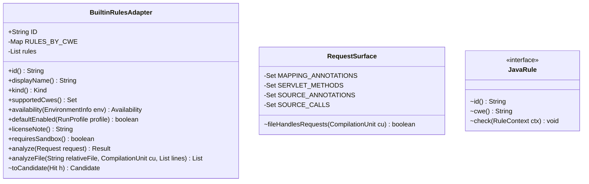

```mermaid
classDiagram
class BuiltinRulesAdapter {
  +String ID
  -Map RULES_BY_CWE
  -List rules
  +id() String
  +displayName() String
  +kind() Kind
  +supportedCwes() Set
  +availability(EnvironmentInfo env) Availability
  +defaultEnabled(RunProfile profile) boolean
  +licenseNote() String
  +requiresSandbox() boolean
  +analyze(Request request) Result
  +analyzeFile(String relativeFile, CompilationUnit cu, List lines) List
  ~toCandidate(Hit h) Candidate
}
class RequestSurface {
  -Set MAPPING_ANNOTATIONS
  -Set SERVLET_METHODS
  -Set SOURCE_ANNOTATIONS
  -Set SOURCE_CALLS
  ~fileHandlesRequests(CompilationUnit cu) boolean
}
class JavaRule {
  <<interface>>
  ~id() String
  ~cwe() String
  ~check(RuleContext ctx) void
}
```
