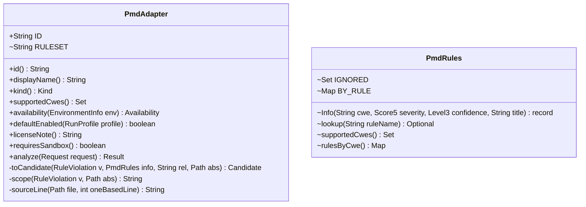

```mermaid
classDiagram
class PmdAdapter {
  +String ID
  ~String RULESET
  +id() String
  +displayName() String
  +kind() Kind
  +supportedCwes() Set
  +availability(EnvironmentInfo env) Availability
  +defaultEnabled(RunProfile profile) boolean
  +licenseNote() String
  +requiresSandbox() boolean
  +analyze(Request request) Result
  -toCandidate(RuleViolation v, PmdRules info, String rel, Path abs) Candidate
  -scope(RuleViolation v, Path abs) String
  -sourceLine(Path file, int oneBasedLine) String
}
class PmdRules {
  ~Set IGNORED
  ~Map BY_RULE
  ~Info(String cwe, Score5 severity, Level3 confidence, String title) record
  ~lookup(String ruleName) Optional
  ~supportedCwes() Set
  ~rulesByCwe() Map
}
```
