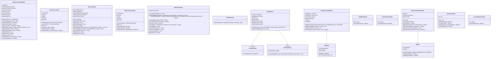

```mermaid
classDiagram
class DisproverContextBuilder {
  +int RADIUS
  +int MAX_METHOD_LINES
  +int MAX_CONTEXT_CHARS
  -SourceIndex sources
  -ReconFacts facts
  -boolean haveFacts
  -JavaParser parser
  -Map methodCache
  +build(Candidate c) DisproverInput
  +controlCatalogue(List cwe) String
  -entryFact(Finding first) Optional
  -sinkFact(Finding last) Optional
  -matches(Location l, Finding s) boolean
  -addRange(List ranges, List files, String file, Optional r) void
  -window(String file, int line) Optional
  -stepRange(String file, int line) Optional
  -methods(String file) List
  -lines(String file) Optional
  -merge(List ranges) List
  -nonBlank(String s, String fallback) String
  -resource(String name) Optional
}
class ProjectSourceIndex {
  -Set SKIPPED
  -Path root
  -List files
  -Set fileSet
  -Map cache
  ~of(PipelineState state) ProjectSourceIndex
  ~scan(Path root) ProjectSourceIndex
  +files() List
  +exists(String path) boolean
  +lines(String path) Optional
  +line(String path, int oneBasedLine) Optional
}
class DisproverAgent {
  +String TEMPLATE_ID
  +String SCHEMA_ID
  ~String TEMPLATE_RESOURCE
  ~int MAX_OUTPUT_TOKENS
  -String INSTRUCTIONS
  +role() AgentRole
  +outputSchemaId() String
  +outputType() Class
  +promptTemplateId() String
  +instructions() String
  +buildRequest(DisproverInput input, PromptRenderer renderer) LlmClient
  -userPrompt(DisproverInput in, PromptRenderer renderer) String
  -claimText(DisproverInput in) String
  -fact(Optional f) String
  -loadInstructions() String
}
class EvidenceSourceIndex {
  -Set SKIPPED
  -Path root
  -List files
  -Set fileSet
  -Map cache
  ~scan(Path target) EvidenceSourceIndex
  +files() List
  +exists(String path) boolean
  +lines(String path) Optional
  +line(String path, int oneBasedLine) Optional
}
class EvidenceRecords {
  ~String PLAN_LOCAL
  ~recordable(Candidate c) boolean
  ~needsValidation(Candidate c, Optional prior, String blocker, List evidence) Finding
  ~confirmed(Candidate c, DisproverResult draft, Optional prior, TestGenResult test, TestEvidence failed, List all) Optional
  ~severity(DisproverResult draft) Finding
  -draftTrace(DisproverResult draft) Optional
  -fullTrace(List steps) Optional
  -ext(Candidate c, Optional prior, Optional hint, List evidence) Finding
  -title(Candidate c) String
  -description(Candidate c) String
  -rootCause(Candidate c) String
  -evidence(Candidate c) List
  -blank(String s) boolean
}
class TestEvidenceId {
  +of(String fingerprint, TestEvidence phase, int attempt) String
}
class AgentRunner {
  +int MAX_ATTEMPTS
  -OutputDecoder STRICT
  -LlmClient llm
  -Agent renderer
  -DiscardListener listener
  -OutputDecoder decoder
  -SecureRandom random
  +run(Agent agent, I input, GroundingContext grounding) AgentOutcome
  -newAgentId(AgentRole role) String
}
class DiscardListener {
  <<interface>>
  ~DiscardListener NONE
  ~discarded(AgentRole role, String agentId, int attempt, String reason) void
}
class OutputDecoder {
  <<interface>>
  ~decode(String text, Class type) T
}
class Payloads {
  ~String RESOURCE
  -Map byFamily
  +bundled() Payloads
  +forFamily(String family) List
}
class TestGenContextBuilder {
  +int DEFAULT_RADIUS
  +int DEFAULT_MAX_FILES
  -SourceIndex sources
  -Payloads payloads
  -int radius
  -int maxFiles
  +build(String family, DisproverResult draft, List testDependencies) TestGenInput
  -add(Map linesByFile, String file, int line) void
  -windows(String file, List lines) List
  -slice(String file, List text, int from, int to) Snippet
}
class DeadBranchRule {
  +id() String
  +check(SinkSite site) Optional
}
class Refuter {
  +Set FAMILIES
  -List rules
  +check(Candidate candidate, CompilationUnit unit) Optional
  ~family(Candidate c) Optional
  ~sinkStep(Candidate c) Optional
}
class ValueOverwrittenRule {
  +id() String
  +check(SinkSite site) Optional
}
class DeterministicRefuterNode {
  +String ID
  -Function indexFactory
  -Refuter refuter
  +id() String
  +requiresLlm() boolean
  +usesSandbox() boolean
  +apply(PipelineState state, RunContext ctx) Result
  ~toRecord(Candidate c, Refutation r) Finding
  -text(String value, String fallback) String
  -parse(SourceIndex index, String file) Optional
}
class DiskSourceIndex {
  -Path root
  +files() List
  +exists(String path) boolean
  +lines(String path) Optional
  +line(String path, int oneBasedLine) Optional
  -resolve(String path) Optional
}
class ConstantArgumentRule {
  +id() String
  +check(SinkSite site) Optional
}
AgentRunner --> OutputDecoder
AgentRunner --> DiscardListener
TestGenContextBuilder --> Payloads
DeterministicRefuterNode --> Refuter
```
