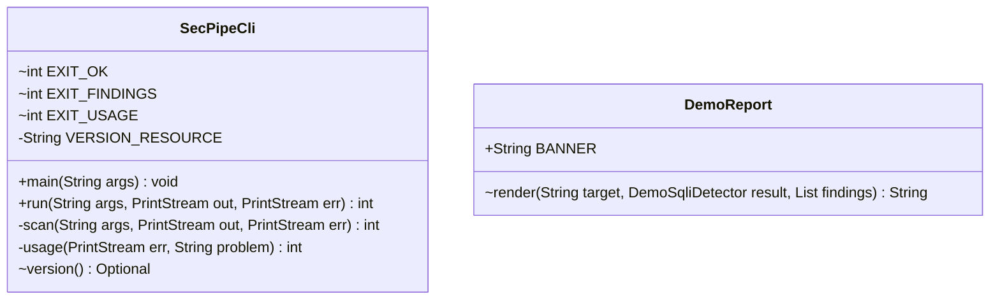

```mermaid
classDiagram
class SecPipeCli {
  ~int EXIT_OK
  ~int EXIT_FINDINGS
  ~int EXIT_USAGE
  -String VERSION_RESOURCE
  +main(String args) void
  +run(String args, PrintStream out, PrintStream err) int
  -scan(String args, PrintStream out, PrintStream err) int
  -usage(PrintStream err, String problem) int
  ~version() Optional
}
class DemoReport {
  +String BANNER
  ~render(String target, DemoSqliDetector result, List findings) String
}
```
