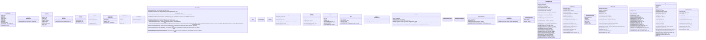

```mermaid
classDiagram
class PipelineGraph {
  +String START
  +String END
  +String NEXT
  +String SKIPPED
  +String LOOP
  +String DONE
  +Map NODES
  +Map TRANSITIONS
  +List REQUIRED_FOR_COMPLETE
  -ordered(String kv) Map
}
class GraphRunner {
  <<interface>>
  ~run(PipelineState initial, RunContext ctx) PipelineState
}
class RunContext {
  <<interface>>
  ~workDir() Path
  ~outDir() Path
  ~llm() LlmClient
  ~sandbox() Optional
  ~budget() Budget
  ~adapters() List
  ~rescanner() Rescanner
  ~clock() Clock
  ~log() RunLog
}
class Rescanner {
  <<interface>>
  ~rescan(Path workingCopy, Set scopeFiles) List
}
class RunLog {
  <<interface>>
  ~info(String msg) void
  ~warn(String msg) void
  ~debug(String msg) void
}
class RunProfile {
  <<enumeration>>
  -int maxHunterWaves
  -int maxCriticPasses
  -boolean verifyAllRecords
  +maxHunterWaves() int
  +maxCriticPasses() int
  +verifyAllRecords() boolean
}
class ProviderMode {
  <<enumeration>>
  -String cliName
  +cliName() String
  +fromCli(String s) ProviderMode
}
class ConfigException {
  -long serialVersionUID
  -String problem
  -String hint
  +problem() String
  +hint() String
}
class AgentRole {
  <<enumeration>>
  -boolean strongByDefault
  +strongByDefault() boolean
}
class AgentOutputs {
  +Citation(String file, int line, String description, String quote) record
  +Step(Finding kind, String file, int line, String scope, String description, Optional quote) record
  +HunterCandidate(String title, String cwe, String principal, String acceptedInput, String strongestControl, String claimedRootCause, List trace, List evidence, String smallestFix, String regressionCase) record
  +HunterResult(String coverageId, Status status, List reviewedPaths, List localChecks, List candidates, List unresolved, List hardeningNotes) record
  +MissingUnit(String surfaceRef, String boundaryRef, String subsystemRef, String attackClassBlock, Optional cwe, List startingPaths, String reason) record
  +Reassignment(String coverageId, String reason) record
  +CriticResult(List missingUnits, List reassignIds, boolean stop, String rationale) record
  +ControlExamined(String file, int line, String quote, String description, boolean effective) record
  +ProposedSeverity(Finding likelihood, Finding impact, String likelihoodReason, String impactReason) record
  +DisproverResult(String fingerprint, Finding verdict, boolean entrypointValid, boolean sinkValid, List controlsExamined, Optional refutationPattern, Optional rootCause, Optional intendedBehavior, List trace, List evidence, List conditions, Optional proposedSeverity, List blockers, Optional validationPlan, Optional reason) record
  +RecordVerifierResult(String fingerprint, Outcome outcome, int checkedCitations, boolean material, List changedFields, Optional replacement, String reason) record
  +TestGenResult(String fingerprint, String packageName, String className, String source, List targetSymbols, List payloads, String expectedFailure, String rationale) record
  +DependencyChange(String purl, String toVersion) record
  +RemediationResult(String fingerprint, String invariant, Citation decisionPoint, String strategy, String patch, List filesChanged, Optional dependencyChange, List riskNotes) record
}
class Status {
  <<enumeration>>
}
class RefutationPattern {
  <<enumeration>>
}
class Outcome {
  <<enumeration>>
}
class CoverageIds {
  +String QUICK_SUBSYSTEM
  -Pattern AGENT_ROLE
  +of(LedgerUnit refs) String
  -member(StringBuilder json, String key, String rawValue) StringBuilder
  -canonicalRef(String key, String rawValue) String
  -isSpace(int codePoint) boolean
  +newAgentId(String role, java rng) String
}
class SourceIndex {
  <<interface>>
  ~files() List
  ~exists(String path) boolean
  ~lines(String path) Optional
  ~line(String path, int oneBasedLine) Optional
  ~requireRelativePath(String path) String
  -hasDriveLetter(String path) boolean
}
class Budget {
  <<interface>>
  ~max() int
  ~used() int
  ~remaining() int
  ~reserve(AgentRole role, int n) int
  ~tryAcquire(AgentRole role) boolean
  ~exhausted() boolean
  ~tryAcquireSandboxRun() boolean
}
class Agent {
  <<interface>>
  ~role() AgentRole
  ~outputSchemaId() String
  ~outputType() Class
  ~promptTemplateId() String
  ~buildRequest(I input, PromptRenderer renderer) LlmClient
}
class PromptRenderer {
  <<interface>>
  ~template(String templateId, java vars) String
  ~untrusted(String path, int fromLine, int toLine, String content) String
}
class LlmClient {
  <<interface>>
  ~mode() ProviderMode
  ~modelFor(AgentRole role) ModelInfo
  ~complete(AgentRole role, Request request) Response
  ~ModelInfo(ProviderMode provider, String modelId, CapabilityTier tier) record
  ~Request(String systemPrompt, String userPrompt, String jsonSchemaId, int maxOutputTokens, double temperature, String promptTemplateId) record
  ~Response(String text, ModelInfo model, long inputTokens, long outputTokens, int attempts, Optional fallbackNote) record
}
class LlmUnavailableException {
}
class BudgetExhaustedException {
}
class LlmProviderFactory {
  <<interface>>
  ~mode() ProviderMode
  ~defaultModels() Map
  ~probe(SecPipeConfig config, Map env) Optional
  ~create(SecPipeConfig config, Map env) ProviderClient
  ~RawCompletion(String text, long inputTokens, long outputTokens) record
}
class ProviderClient {
  <<interface>>
  ~complete(String modelId, LlmClient request) RawCompletion
}
class RateLimitedException {
  -Optional retryAfter
  +retryAfter() Optional
}
class RunMetadataCodec {
  +module() JacksonModule
  +read(Path file) RunMetadata
  +read(String json) RunMetadata
  +write(RunMetadata metadata) String
  +write(Path file, RunMetadata metadata) void
  +toTree(RunMetadata metadata) ObjectNode
  +fromTree(JsonNode node) RunMetadata
  -writeMetadata(RunMetadata m, String path) ObjectNode
  -readMetadata(JsonNode node, String path) RunMetadata
  -writeScope(Scope s, String path) ObjectNode
  -readScope(JsonNode node, String path) Scope
  -writeTarget(Target t, String path) ObjectNode
  -readTarget(JsonNode node, String path) Target
  -writeAi(Ai a, String path) ObjectNode
  -readAi(JsonNode node, String path) Ai
  -writeFallback(Fallback f, String path) ObjectNode
  -readFallback(JsonNode node, String path) Fallback
  -writeModel(ModelAssignment m, String path) ObjectNode
  -readModel(JsonNode node, String path) ModelAssignment
  -writeUsage(Usage u, String path) ObjectNode
  -readUsage(JsonNode node, String path) Usage
  -writeBudget(BudgetSnapshot b, String path) ObjectNode
  -readBudget(JsonNode node, String path) BudgetSnapshot
  -writeTool(ToolRun t, String path) ObjectNode
  -readTool(JsonNode node, String path) ToolRun
  -writeSandbox(Sandbox s, String path) ObjectNode
  -readSandbox(JsonNode node, String path) Sandbox
  -writePriorRun(PriorRun p, String path) ObjectNode
  -readPriorRun(JsonNode node, String path) PriorRun
  -writeCounts(Counts c, String path) ObjectNode
  -readCounts(JsonNode node, String path) Counts
  -writeValidators(Validators v, String path) ObjectNode
  -readValidators(JsonNode node, String path) Validators
}
class ContractJson {
  -PrettyPrinter PRETTY
  -JsonMapper MAPPER
  -ObjectWriter PRETTY_WRITER
  +mapper() JsonMapper
  +mapper(JacksonModule extra) JsonMapper
  +prettyPrinter() PrettyPrinter
  +readFindings(Path file) List
  +readFindings(String json) List
  +findingsTree(List findings) ArrayNode
  +writeFindings(List findings) String
  +writeFindings(Path file, List findings) void
  +readCandidates(Path file) List
  +readCandidates(String json) List
  +writeCandidates(List candidates) String
  +writeCandidates(Path file, List candidates) void
  -pretty(JsonNode tree) String
  -readArray(String json, Function reader) List
  -rebase(int index, Supplier step) T
  -readFile(Path file) String
  -writeFile(Path file, String content) void
  -build(List extra) JsonMapper
  -contractModule() SimpleModule
  -register(SimpleModule module, Class type) void
}
class ContractJsonException {
  -long serialVersionUID
  -String path
  -String problem
  +path() String
  +problem() String
  +property() Optional
}
class LedgerCodec {
  -JsonNodeFactory NODES
  +module() JacksonModule
  +read(Path file) List
  +read(String json) List
  +write(List units) String
  +write(Path file, List units) void
  +toTree(LedgerUnit unit) ObjectNode
  +fromTree(JsonNode node) LedgerUnit
  -writeUnit(LedgerUnit u, String path) ObjectNode
  -readUnit(JsonNode node, String path) LedgerUnit
  -writeRefs(CanonicalRefs r, String path) ObjectNode
  -readRefs(JsonNode node, String path) CanonicalRefs
  -writeExcluded(ExcludedBlock b, String path) ObjectNode
  -readExcluded(JsonNode node, String path) ExcludedBlock
  -writeAttempt(Attempt a, String path) ObjectNode
  -readAttempt(JsonNode node, String path) Attempt
  ~adapt(SimpleModule module, Class type, Function writer, Function reader) void
  ~parse(String json) JsonNode
  ~pretty(JsonNode tree) String
  ~readFile(Path file) String
  ~writeFile(Path file, String content) void
  ~enumName(Enum value) String
  ~describe(JsonNode node) String
}
class Out {
  -ObjectNode node
  -String path
  ~node() ObjectNode
  -at(String key) String
  -required(String key, T value) T
  ~str(String key, String value) void
  ~optStr(String key, Optional value) void
  ~nullableStr(String key, Optional value) void
  ~integer(String key, int value) void
  ~longValue(String key, long value) void
  ~optDouble(String key, Optional value) void
  ~bool(String key, boolean value) void
  ~instant(String key, Instant value) void
  ~enumValue(String key, Enum value) void
  ~enumValue(String key, E value, Function name) void
  ~obj(String key, T value, BiFunction writer) void
  ~optObj(String key, Optional value, BiFunction writer) void
  ~list(String key, List values, BiFunction writer, boolean always) void
  ~strList(String key, List values, boolean always) void
  ~numberMap(String key, Map values, boolean always) void
}
class In {
  -JsonNode node
  -String path
  -Set seen
  -at(String key) String
  -value(String key) Optional
  -requiredValue(String key) JsonNode
  -asText(JsonNode v, String at) String
  -asInt(JsonNode v, String at) int
  -asLong(JsonNode v, String at) long
  ~str(String key) String
  ~optStr(String key) Optional
  ~nullableStr(String key) Optional
  ~integer(String key) int
  ~intOrZero(String key) int
  ~longValue(String key) long
  ~optDouble(String key) Optional
  ~bool(String key) boolean
  ~instant(String key) Instant
  ~enumValue(String key, Class type) E
  ~enumValue(String key, Class type, Function name) E
  ~obj(String key, BiFunction reader) T
  ~optObj(String key, BiFunction reader) Optional
  -elements(String key, boolean required, BiFunction reader) List
  ~list(String key, BiFunction reader, boolean required) List
  ~strList(String key, boolean required) List
  -map(String key, boolean required, BiFunction reader) Map
  ~intMap(String key, boolean required) Map
  ~longMap(String key, boolean required) Map
  ~done() void
}
class ReconFactsCodec {
  +String FILE_NAME
  +String SCHEMA_RESOURCE
  -String SCHEMA_ID
  -JsonNodeFactory NODES
  -Schema SCHEMA
  +read(Path file) ReconFacts
  +read(String json) ReconFacts
  +fromTree(JsonNode node) ReconFacts
  +toTree(ReconFacts facts) ObjectNode
  +write(ReconFacts facts) String
  +write(Path file, ReconFacts facts) void
  -writeLocations(List locations) ArrayNode
  -readLocations(JsonNode array, String path) List
  -pointerEscape(String key) String
  -failOnSchemaErrors(List errors) void
  -loadSchema() Schema
  -resource(String name) String
}
```
