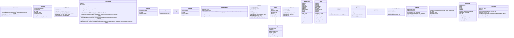

```mermaid
classDiagram
class AdapterRunner {
  ~Outcome(AnalyzerAdapter result, RunMetadata run) record
  ~runAll(List selected, Function requestFor, Duration timeout, RunContext ctx) List
  -runOne(AdapterSelector s, Function requestFor, Duration timeout, RunContext ctx) Outcome
  -failed(AdapterSelector s, String reason, long ms) Outcome
  -empty() AnalyzerAdapter
}
class DetectNode {
  ~String REQUIRES_SANDBOX
  -Function discovery
  +id() String
  +requiresLlm() boolean
  +usesSandbox() boolean
  +apply(PipelineState state, RunContext ctx) Result
  -selections(PipelineState state, RunContext ctx) List
  -workDir(RunContext ctx, String adapterId) Path
  -unfingerprinted(Candidate c) Candidate
}
class LedgerSettlement {
  -KnowledgeBase kb
  ~ToolClaim(String toolId, AnalyzerAdapter claim) record
  ~settle(List ledger, List claims, List candidates) List
  -settleOne(LedgerUnit unit, List claims, List candidates) Optional
  -sitsIn(Candidate c, String family, Set files) boolean
  ~underAny(String file, List startingPaths) boolean
}
class LedgerTransitions {
  +String RULE
  -Map ALLOWED
  +allowedTargets(Status from) Set
  +isListed(Status from, Status to) boolean
  +check(LedgerUnit prev, LedgerUnit next, String path) Optional
  -archived(LedgerUnit prev, LedgerUnit next) boolean
  -error(String path, String message) Optional
  +name(Status s) String
  +assign(String coverageId, String agentId) LedgerUnit
  +covered(String coverageId, String agentId, List reviewedPaths, List localChecks) LedgerUnit
  +candidate(String coverageId, String agentId, List reviewedPaths, List localChecks, List resultFingerprints, List unresolved) LedgerUnit
  +blocked(String coverageId, String agentId, List blockers) LedgerUnit
  +toolSettled(String coverageId, Status status, List settledBy, List reviewedPaths, List localChecks, List resultFingerprints) LedgerUnit
  +reassign(String coverageId, String previousAgentId, String reason) LedgerUnit
  +close(String coverageId, Status status, String reason) LedgerUnit
  -update(String coverageId, Status status, Optional agentId, List reviewedPaths, List localChecks, List resultFingerprints, List unresolved, List settledBy, Optional archiveReason) LedgerUnit
}
class NormalizeNode {
  -CandidateMerger merger
  +id() String
  +requiresLlm() boolean
  +usesSandbox() boolean
  +apply(PipelineState state, RunContext ctx) Result
}
class Scopes {
  +canonical(String scope) String
}
class ImpactClass {
  <<enumeration>>
}
class ScoringNode {
  -ScoringPolicy policy
  +id() String
  +requiresLlm() boolean
  +usesSandbox() boolean
  +apply(PipelineState state, RunContext ctx) Result
}
class RunMetadataBuilder {
  ~int SCHEMA_VERSION
  ~String FALLBACK_VERSION
  +build(PipelineState state, Instant finishedAt, Budget budget, boolean sandbox, Optional incompleteReason, RunMetadata validators) RunMetadata
  ~counts(PipelineState state) RunMetadata
  -target(PipelineState state) RunMetadata
  -version() String
}
class FinalizeNode {
  +String RUN_METADATA
  ~int MAX_QUOTED_ERRORS
  -ScoringPolicy policy
  +id() String
  +requiresLlm() boolean
  +usesSandbox() boolean
  +apply(PipelineState state, RunContext ctx) Result
  -quote(ValidationResult result) String
  -status(ValidationResult r) RunMetadata
  -write(Path outDir, RunMetadata metadata) void
}
class DefaultRunLog {
  -SecPipeConfig verbosity
  -Consumer sink
  +discarding() DefaultRunLog
  +collecting() Collecting
  +info(String msg) void
  +warn(String msg) void
  +debug(String msg) void
  -emit(String level, String msg) void
}
class Collecting {
  -List lines
  -DefaultRunLog delegate
  -add(String line) void
  +lines() List
  +info(String msg) void
  +warn(String msg) void
  +debug(String msg) void
}
class EngineCheckpoint {
  +String FILE_NAME
  -JsonMapper MAPPER
  +write(PipelineState state, Path dir) Path
  +toJson(PipelineState s) String
  -prior(PipelineState p) ObjectNode
  -sorted(Map m) Map
}
class DefaultRunContext {
  -Path workDir
  -Path outDir
  -LlmClient llm
  -Optional sandbox
  -Budget budget
  -List adapters
  -Rescanner rescanner
  -Clock clock
  -RunLog log
  +builder() Builder
  +workDir() Path
  +outDir() Path
  +llm() LlmClient
  +sandbox() Optional
  +budget() Budget
  +adapters() List
  +rescanner() Rescanner
  +clock() Clock
  +log() RunLog
}
class Builder {
  -Path workDir
  -Path outDir
  -LlmClient llm
  -Optional sandbox
  -Budget budget
  -List adapters
  -Rescanner rescanner
  -Clock clock
  -RunLog log
  +workDir(Path p) Builder
  +outDir(Path p) Builder
  +llm(LlmClient c) Builder
  +sandbox(Optional s) Builder
  +budget(Budget b) Builder
  +adapters(List a) Builder
  +rescanner(Rescanner r) Builder
  +clock(Clock c) Builder
  +log(RunLog l) Builder
  +build() DefaultRunContext
}
class DisabledLlm {
  <<enumeration>>
  +mode() ProviderMode
  +modelFor(AgentRole role) ModelInfo
  +complete(AgentRole role, Request request) Response
}
class ZeroBudget {
  <<enumeration>>
  +max() int
  +used() int
  +remaining() int
  +reserve(AgentRole role, int n) int
  +tryAcquire(AgentRole role) boolean
  +exhausted() boolean
  +tryAcquireSandboxRun() boolean
}
class NoRescanner {
  <<enumeration>>
  +rescan(Path workingCopy, Set scopeFiles) List
}
class DeltaRejectedException {
  -long serialVersionUID
  -ValidationResult validation
  +validation() Optional
  +incompleteReason(String nodeId) String
}
class DeltaApplier {
  -EngineValidators validators
  -LedgerStore ledgerStore
  +freeze(PipelineState state) PipelineState
  +apply(PipelineState state, StateDelta delta) PipelineState
  -applyChecked(PipelineState s, StateDelta d) PipelineState
  -putAll(Map base, Map add) Map
  -requireFields(StateDelta d) void
}
class ReconNode {
  +Outcome(FileSourceIndex index, ReconFacts facts, List units, List notes) record
  +id() String
  +requiresLlm() boolean
  +usesSandbox() boolean
  +apply(PipelineState state, RunContext ctx) Result
  +run(Path root, boolean includeTests) Outcome
  -isTestSource(String file) boolean
}
class FileSourceIndex {
  +Set SKIPPED_DIRS
  -Path root
  -List files
  -Set fileSet
  -Map cache
  +of(Path root, Collection files) FileSourceIndex
  +scan(Path root) FileSourceIndex
  +root() Path
  +files() List
  +exists(String path) boolean
  +lines(String path) Optional
  +line(String path, int oneBasedLine) Optional
  -read(String path) Optional
  -toPosix(Path rel) String
  -isValid(String rel) boolean
}
class LedgerSeeder {
  -Map ATTACK_CLASS
  -Map BLOCK
  ~seed(List surfaces, ReconFacts facts, List families) List
  -put(Map byId, LedgerUnit u) void
  -unit(LedgerUnit refs, String surface, String boundary, String family, String file) LedgerUnit
  -attackRef(String family) String
  -subsystem(String file) String
  -subsystemLabel(String file) String
  -fileName(String file) String
}
Collecting --> DefaultRunLog
```
