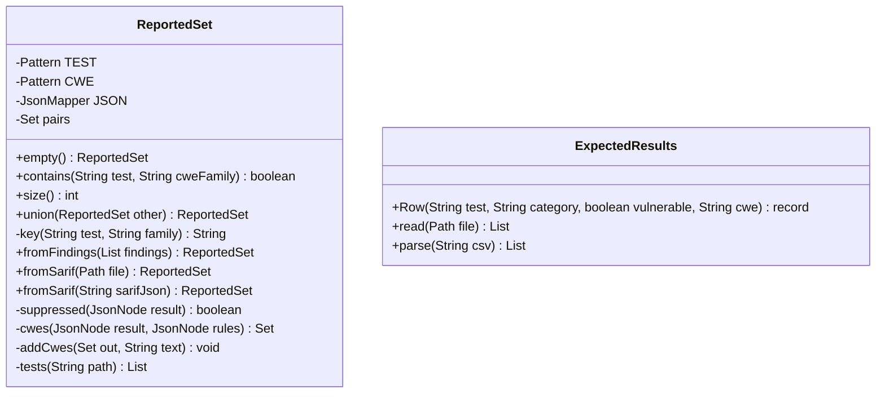

```mermaid
classDiagram
class ReportedSet {
  -Pattern TEST
  -Pattern CWE
  -JsonMapper JSON
  -Set pairs
  +empty() ReportedSet
  +contains(String test, String cweFamily) boolean
  +size() int
  +union(ReportedSet other) ReportedSet
  -key(String test, String family) String
  +fromFindings(List findings) ReportedSet
  +fromSarif(Path file) ReportedSet
  +fromSarif(String sarifJson) ReportedSet
  -suppressed(JsonNode result) boolean
  -cwes(JsonNode result, JsonNode rules) Set
  -addCwes(Set out, String text) void
  -tests(String path) List
}
class ExpectedResults {
  +Row(String test, String category, boolean vulnerable, String cwe) record
  +read(Path file) List
  +parse(String csv) List
}
```
