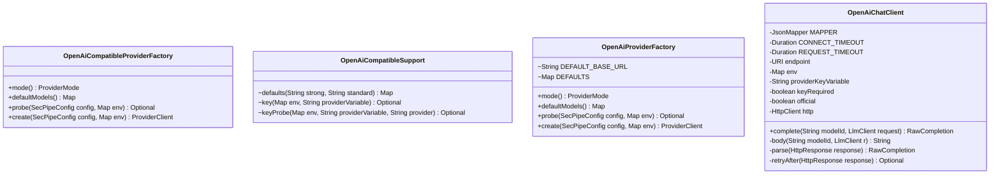

```mermaid
classDiagram
class OpenAiCompatibleProviderFactory {
  +mode() ProviderMode
  +defaultModels() Map
  +probe(SecPipeConfig config, Map env) Optional
  +create(SecPipeConfig config, Map env) ProviderClient
}
class OpenAiCompatibleSupport {
  ~defaults(String strong, String standard) Map
  ~key(Map env, String providerVariable) Optional
  ~keyProbe(Map env, String providerVariable, String provider) Optional
}
class OpenAiProviderFactory {
  ~String DEFAULT_BASE_URL
  ~Map DEFAULTS
  +mode() ProviderMode
  +defaultModels() Map
  +probe(SecPipeConfig config, Map env) Optional
  +create(SecPipeConfig config, Map env) ProviderClient
}
class OpenAiChatClient {
  -JsonMapper MAPPER
  -Duration CONNECT_TIMEOUT
  -Duration REQUEST_TIMEOUT
  -URI endpoint
  -Map env
  -String providerKeyVariable
  -boolean keyRequired
  -boolean official
  -HttpClient http
  +complete(String modelId, LlmClient request) RawCompletion
  -body(String modelId, LlmClient r) String
  -parse(HttpResponse response) RawCompletion
  -retryAfter(HttpResponse response) Optional
}
```
