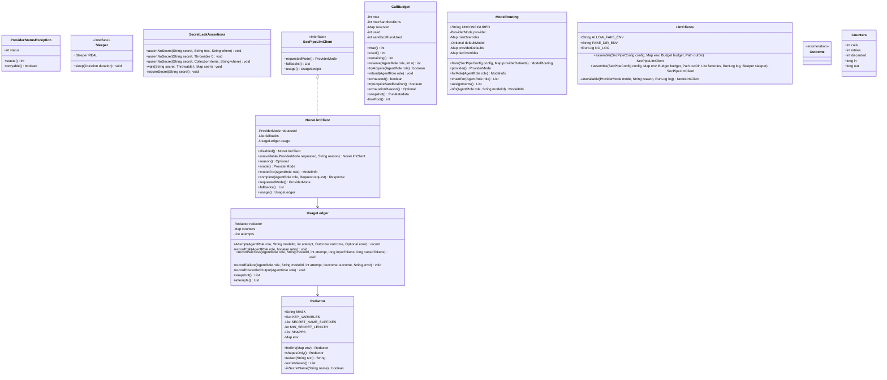

```mermaid
classDiagram
class Redactor {
  +String MASK
  +Set KEY_VARIABLES
  -List SECRET_NAME_SUFFIXES
  -int MIN_SECRET_LENGTH
  -List SHAPES
  -Map env
  +forEnv(Map env) Redactor
  +shapesOnly() Redactor
  +redact(String text) String
  -secretValues() List
  ~isSecretName(String name) boolean
}
class ProviderStatusException {
  -int status
  +status() int
  +retryable() boolean
}
class Sleeper {
  <<interface>>
  ~Sleeper REAL
  ~sleep(Duration duration) void
}
class SecretLeakAssertions {
  +assertNoSecret(String secret, String text, String where) void
  +assertNoSecret(String secret, Throwable t) void
  +assertNoSecret(String secret, Collection items, String where) void
  -walk(String secret, Throwable t, Map seen) void
  -requireSecret(String secret) void
}
class SecPipeLlmClient {
  <<interface>>
  ~requestedMode() ProviderMode
  ~fallbacks() List
  ~usage() UsageLedger
}
class NoneLlmClient {
  -ProviderMode requested
  -List fallbacks
  -UsageLedger usage
  +disabled() NoneLlmClient
  +unavailable(ProviderMode requested, String reason) NoneLlmClient
  +reason() Optional
  +mode() ProviderMode
  +modelFor(AgentRole role) ModelInfo
  +complete(AgentRole role, Request request) Response
  +requestedMode() ProviderMode
  +fallbacks() List
  +usage() UsageLedger
}
class CallBudget {
  -int max
  -int maxSandboxRuns
  -Map reserved
  -int used
  -int sandboxRunsUsed
  +max() int
  +used() int
  +remaining() int
  +reserve(AgentRole role, int n) int
  +tryAcquire(AgentRole role) boolean
  +refund(AgentRole role) void
  +exhausted() boolean
  +tryAcquireSandboxRun() boolean
  +exhaustionReason() Optional
  +snapshot() RunMetadata
  -freePool() int
}
class ModelRouting {
  +String UNCONFIGURED
  -ProviderMode provider
  -Map roleOverrides
  -Optional defaultModel
  -Map providerDefaults
  -Map tierOverrides
  +from(SecPipeConfig config, Map providerDefaults) ModelRouting
  +provider() ProviderMode
  +forRole(AgentRole role) ModelInfo
  +chainFor(AgentRole role) List
  +assignments() List
  -info(AgentRole role, String modelId) ModelInfo
}
class LlmClients {
  +String ALLOW_FAKE_ENV
  +String FAKE_DIR_ENV
  +RunLog NO_LOG
  +assemble(SecPipeConfig config, Map env, Budget budget, Path outDir) SecPipeLlmClient
  +assemble(SecPipeConfig config, Map env, Budget budget, Path outDir, List factories, RunLog log, Sleeper sleeper) SecPipeLlmClient
  -unavailable(ProviderMode mode, String reason, RunLog log) NoneLlmClient
}
class UsageLedger {
  -Redactor redactor
  -Map counters
  -List attempts
  +Attempt(AgentRole role, String modelId, int attempt, Outcome outcome, Optional error) record
  +recordCall(AgentRole role, boolean retry) void
  +recordSuccess(AgentRole role, String modelId, int attempt, long inputTokens, long outputTokens) void
  +recordFailure(AgentRole role, String modelId, int attempt, Outcome outcome, String error) void
  +recordDiscardedOutput(AgentRole role) void
  +snapshot() List
  +attempts() List
}
class Outcome {
  <<enumeration>>
}
class Counters {
  ~int calls
  ~int retries
  ~int discarded
  ~long in
  ~long out
}
SecPipeLlmClient <|.. NoneLlmClient
NoneLlmClient --> UsageLedger
UsageLedger --> Redactor
```
