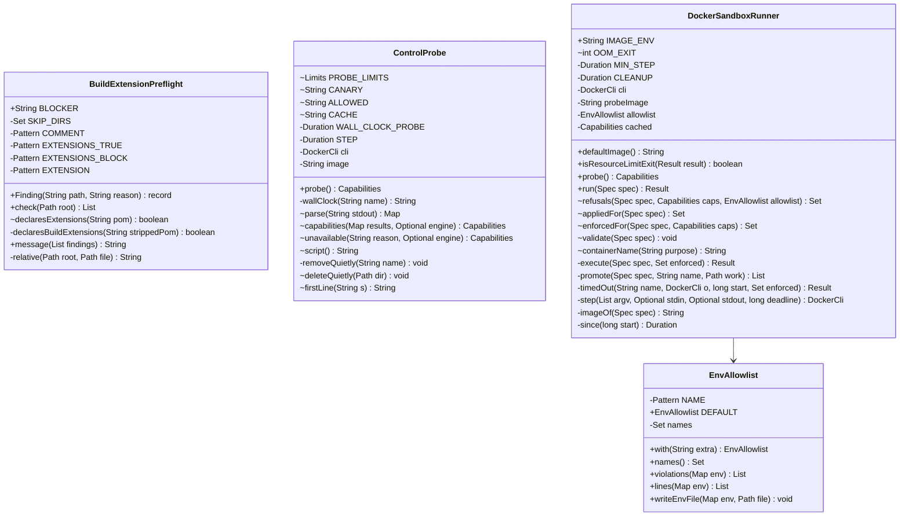

```mermaid
classDiagram
class BuildExtensionPreflight {
  +String BLOCKER
  -Set SKIP_DIRS
  -Pattern COMMENT
  -Pattern EXTENSIONS_TRUE
  -Pattern EXTENSIONS_BLOCK
  -Pattern EXTENSION
  +Finding(String path, String reason) record
  +check(Path root) List
  ~declaresExtensions(String pom) boolean
  -declaresBuildExtensions(String strippedPom) boolean
  +message(List findings) String
  -relative(Path root, Path file) String
}
class EnvAllowlist {
  -Pattern NAME
  +EnvAllowlist DEFAULT
  -Set names
  +with(String extra) EnvAllowlist
  +names() Set
  +violations(Map env) List
  +lines(Map env) List
  +writeEnvFile(Map env, Path file) void
}
class ControlProbe {
  ~Limits PROBE_LIMITS
  ~String CANARY
  ~String ALLOWED
  ~String CACHE
  -Duration WALL_CLOCK_PROBE
  -Duration STEP
  -DockerCli cli
  -String image
  +probe() Capabilities
  -wallClock(String name) String
  ~parse(String stdout) Map
  ~capabilities(Map results, Optional engine) Capabilities
  ~unavailable(String reason, Optional engine) Capabilities
  ~script() String
  -removeQuietly(String name) void
  ~deleteQuietly(Path dir) void
  ~firstLine(String s) String
}
class DockerSandboxRunner {
  +String IMAGE_ENV
  ~int OOM_EXIT
  -Duration MIN_STEP
  -Duration CLEANUP
  -DockerCli cli
  -String probeImage
  -EnvAllowlist allowlist
  -Capabilities cached
  +defaultImage() String
  +isResourceLimitExit(Result result) boolean
  +probe() Capabilities
  +run(Spec spec) Result
  ~refusals(Spec spec, Capabilities caps, EnvAllowlist allowlist) Set
  ~appliedFor(Spec spec) Set
  ~enforcedFor(Spec spec, Capabilities caps) Set
  ~validate(Spec spec) void
  ~containerName(String purpose) String
  -execute(Spec spec, Set enforced) Result
  -promote(Spec spec, String name, Path work) List
  -timedOut(String name, DockerCli o, long start, Set enforced) Result
  -step(List argv, Optional stdin, Optional stdout, long deadline) DockerCli
  -imageOf(Spec spec) String
  -since(long start) Duration
}
DockerSandboxRunner --> EnvAllowlist
```
